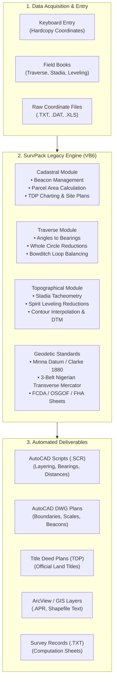

# SurvPack 3.0 / 2.1 — Legacy Architecture & Technical Reference Manual

> **Document Status**: Complete Reverse-Engineered Technical Encyclopedia  
> **Original Application**: SurvPack (Version 3.0.001 / 2.1)  
> **Author**: Julius B. M. Sambo (MCPN, ANIS), Surveying & Mapping Department, FCDA Abuja, Nigeria  
> **Domain**: Land Surveying, Geomatics, Cadastral Layouts, Geodetic Traverse, Topography, and Cartographic CAD Automation  
> **Target Audience**: Software Engineers, Geomatics Engineers, GIS Developers, and Technical Architects rebuilding the system.

---

## 1. Executive Summary & System Overview

**SurvPack** is a desktop Land Surveying and Cartographic computation suite built to bridge raw field measurements (from theodolites, total stations, levels, and GNSS receivers) to finished, survey-grade cartographic drawings (AutoCAD drawings, Title Deed Plans, Site Plans, Cadastral Layouts, and GIS Shapefiles).



### Technical Specification & Profile
* **Development Language**: Microsoft Visual Basic 6.0 (Enterprise Edition SP6).
* **Binary Compilation**: Native 32-bit x86 PE (`SurvPack.exe`, ~7.35 MB) targeting MSVBVM60.DLL runtime.
* **Component Dependencies**: `MSCOMCTL.OCX` (ActiveX Windows Common Controls 6.0 — Toolbars, StatusBars, TreeViews, ProgressBars).
* **Operating System Target**: Windows 95, 98, ME, 2000, XP, Windows 7 (32-bit compatibility mode).
* **Storage Model**: Flat-file database system using comma-separated text files (`.TXT`, `.DAT`), ArcView project files (`.apr`), and Excel worksheets (`.xls`).
* **Interoperability Bridge**: Script-driven automation generating command files (`.SCR`) executed inside Autodesk AutoCAD (R14, 2000–2006+).

---

## 2. Directory Structure & File Hierarchy

The legacy installation layout is structured under a root folder hierarchy:

```
SurvPack30/
├── SurvPack.exe              # Main Visual Basic 6 Executable (7.35 MB)
├── MSCOMCTL.OCX              # Microsoft Windows Common Controls 6.0 ActiveX
├── COMBINATION.dwl / dwl2    # AutoCAD drawing lock files
├── sp30reg.txt               # User registration record (Serial & User ID)
│
├── SPACK/                    # Core Working Template & Cadastral Cache
│   ├── CADASTRAL/            # Working layouts, site plans, TDP working dirs
│   │   ├── LAYOUTS/          # Cached layout scripts
│   │   ├── SITEPLANS/        # Cached site plan scripts
│   │   └── TDP/              # Cached title deed plan jobs
│   ├── SUPPORTS/             # Mirrored graphical support assets
│   └── TEMP/                 # Intermediate computation buffers
│
├── PROJECTS/                 # Active Project Repositories
│   ├── CONTROLS.TXT          # Master Control Points Database
│   ├── CADASTRAL/            # Cadastral Survey Projects
│   │   ├── JOBREG.DAT        # Registered Job Directory Catalog
│   │   ├── PCODES.TXT        # Registered Project Code List
│   │   ├── Pdetails.TXT      # Master Project Metadata (Client, Location, Surveyor)
│   │   ├── REGISTER.TXT      # Plot registration records
│   │   ├── CADPLANS/         # Finished AutoCAD Drawing (.dwg / .bak) files
│   │   ├── COORDS/           # Coordinate lists (.TXT, .XLS)
│   │   ├── DATA/             # Field raw data and report documents (.DOC, .TXT)
│   │   ├── LAYOUTS/          # Generated AutoCAD script files (.SCR) for layouts
│   │   ├── PLOTPB/           # Beacon definitions by plot
│   │   ├── PLOTS/            # Individual parcel geometry files
│   │   ├── PROJ_STATS/       # Statistical summary reports per project
│   │   ├── SITEPLANS/        # Generated AutoCAD scripts for single site plans
│   │   ├── SURVRECS/         # Survey computation record tables
│   │   ├── TDP/              # Title Deed Plan projects & AutoCAD scripts
│   │   │   ├── CHARTING/     # FCDA charting scripts
│   │   │   ├── SURVRECS/     # TDP survey computation records
│   │   │   └── [JobDirs]/    # Individual TDP job folders (e.g., CKCEXTEN, VGIS)
│   │   └── USEDPB/           # Registry of beacons already utilized (prevents reuse)
│   │
│   ├── TRAV/ & TRAVERSE/     # Traverse Field Reduction Projects
│   │   ├── LOOPS/            # Traverse loop definition files
│   │   ├── PHEADER/          # Project header metadata
│   │   └── TFBOOKS/          # Raw traverse field book records
│   │
│   ├── TDPJOBS/              # Batch Title Deed Plan jobs
│   └── TOPO/                 # Topographical & Leveling Projects
│       ├── ACADSCRIPTS/      # Topo AutoCAD point & height plotting scripts
│       ├── CONTOURS/         # Interpolated contour vector lines
│       ├── DTM/              # Digital Terrain Model triangulated meshes
│       ├── HEIGHTS/          # Spot height records
│       ├── PHEADER/          # Topo project headers
│       ├── STATIONS/         # Tacheometry instrument station coordinates
│       ├── TOPOFBKS/         # Topo field books
│       │   ├── SP-LEVS/      # Spirit Leveling field books (Rise & Fall / Collimation)
│       │   ├── STADIA/       # Stadia tacheometry bookings
│       │   └── TARGETH/      # Target height measurements
│       ├── TOPOTEXT/         # Topographic survey grid models (.grd)
│       └── WKSHTS_GRIDS/     # 3D spatial coordinate files (.DAT)
│
├── SUPPORTS/                 # Master Graphical & Cartographic Asset Library
│   ├── DOCUMENTS/            # User Manuals & Theoretical Documentation (.DOC)
│   ├── TEMP/                 # Runtime scratch buffers (PBCOORDS.TMP, PLOTPB.TMP)
│   └── Graphics/             # Standard Survey Cartographic CAD Blocks (.dwg & .bmp)
│       ├── ARROWS/           # Standard North Arrow blocks (N_ARROW.dwg)
│       ├── SCALES/           # Metric Graphic Bar Scales (SC125, SC250, SC500, SC1000, SC2000, SC5000)
│       ├── SYMBOLS/          # Property Beacon Symbols (Pbeacon.dwg)
│       └── TRIMTICKS/        # Sheet Corner Trim Ticks (LL.dwg, LR.dwg, UL.dwg, UR.dwg)
│
└── DATAxxx/                  # Archive of historic client survey data & reports
```

---

## 3. Exhaustive Form & Module Catalog (All 68 Forms)

Decompilation and metadata extraction revealed **68 UI Forms, MDI Windows, and Dialog Components**:

| # | Form / Module Name | Title / Caption | Role & Architectural Purpose | Key Extracted Controls & Variables |
|---|-------------------|-----------------|------------------------------|-----------------------------------|
| 1 | `MDIForm` / `frmMDI` | SurvPack 3.0 Master Shell | MDI Parent window managing application menus, toolbars, status bars, and active project state. | `mnuFile`, `mnuCadastral`, `mnuTraverse`, `mnuTopo`, `mnuUtility`, `sbStatus` |
| 2 | `frmWelcome` / `frmSplash` | Welcome to SurvPack | Splash and startup screen displaying licensing, author credits, and versioning. | `imgLogo`, `lblVersion`, `lblAuthor`, `Timer1` |
| 3 | `frmRegForm` | SurvPack Registration | Software registration modal verifying serial key, company name, and unlock codes. | `txtRegNo`, `txtUserName`, `txtAddress`, `txtPhone`, `cmdRegister` |
| 4 | `dlgExistingPrj` | Open Existing Project | Project selection dialog listing existing projects registered in `PCODES.TXT` / `JOBREG.DAT`. | `lstExistingPrj`, `fraExistingPrj`, `OKButton`, `CancelButton` |
| 5 | `frmNew` | Create New Project | Project initialization wizard capturing project code, title, client, and survey date. | `txtPrjCode`, `txtPrjTitle`, `txtLocation`, `txtSurveyor`, `cmdCreate` |
| 6 | `frmCoordEntry` | Coordinate Data Entry | Interactive grid for entering point IDs, Eastings, Northings, and Heights from hardcopy. | `txtBeaconID`, `txtEasting`, `txtNorthing`, `txtHeight`, `cmdAdd`, `cmdSave` |
| 7 | `frmControls` | Survey Controls Database | Control point manager storing reference geodetic beacons (Primary/Secondary network). | `lstControls`, `txtCtrlID`, `txtCtrlEast`, `txtCtrlNorth`, `cmdUpdateCtrl` |
| 8 | `frmPlotPro` | Plot Definition & Processing | Defines parcel polygon topology by linking beacons in clockwise sequence and computing closure. | `lstBeacons`, `lstPlotBeacons`, `txtPlotNo`, `lblArea`, `cmdCalculateArea` |
| 9 | `frmPrPlot` | Plot Geometry Editor | Form for editing and verifying individual parcel vertices and boundary lengths. | `txtVertex`, `txtBearing`, `txtDistance`, `cmdVerify` |
| 10 | `frmBrgDis` | Bearing & Distance (Inversing) | Inverses coordinates $(E_1, N_1)$ to $(E_2, N_2)$ to compute whole circle bearing and distance. | `txtE1`, `txtN1`, `txtE2`, `txtN2`, `txtBrgDeg`, `txtBrgMin`, `txtBrgSec`, `txtDist` |
| 11 | `frmAngDis` | Angle & Distance Reductions | Computes coordinates given a starting station, backsight bearing, observed angle, and distance. | `txtStation`, `txtBacksight`, `txtAngle`, `txtDistance`, `txtTargetEast`, `txtTargetNorth` |
| 12 | `frmTFBook` | Traverse Field Book | Spreadsheet-like data entry form for raw traverse observations (Face Left / Face Right angles). | `gridFieldBook`, `txtInstStn`, `txtTargetStn`, `txtHorizAngle`, `txtSlopeDist` |
| 13 | `frmProTravOpt` | Traverse Loop Processing | Executes Bowditch / Transit loop closure balancing, misclosure calculation, and coordinate generation. | `optBowditch`, `optTransit`, `txtLinearMisclose`, `txtPrecisionRatio`, `cmdBalance` |
| 14 | `frmCadShts` | Cadastral Sheet Generator | Computes standard sheet boundary grids and partitions for official scales (1:500 to 1:5,000). | `cboScale`, `txtSheetNo`, `txtMinEast`, `txtMaxEast`, `txtMinNorth`, `txtMaxNorth` |
| 15 | `frmShtDet` | Sheet Indexing Determination | Determines which standard map sheet numbers contain a specific $(E, N)$ coordinate pair. | `txtQueryEast`, `txtQueryNorth`, `lblSheet500`, `lblSheet1000`, `lblSheet2000` |
| 16 | `frmShtScales` | Sheet Scales Configuration | Configures drawing scale ratios, text sizing, and border dimension parameters. | `txtScaleRatio`, `txtTextHeight`, `txtMarginSize`, `cmdApply` |
| 17 | `frmSiteplan` | Site Plan Generator | Single-parcel cartographic drawing generator (generates layout, border, title block, scale bar). | `txtPlotID`, `txtClientName`, `cboDrawingScale`, `cmdGenSitePlanScript` |
| 18 | `frmTDPOpts` | Title Deed Plan (TDP) Options | Configuration form for Title Deed Plans according to FCDA / State Survey standards. | `optFCDA`, `optState`, `chkIncludeSurveyRecords`, `chkIncludeAdjoiningOwners` |
| 19 | `frmNewTDPProject` | New TDP Project Wizard | Setup wizard for creating individual Title Deed Plan projects linked to cadastral layouts. | `txtTDPNo`, `txtPlanNo`, `txtOwnerName`, `txtLocationDesc`, `cmdInitTDP` |
| 20 | `frmFCT` | Federal Capital Territory Standard | Specialized template engine tailored to Abuja FCDA cadastral charting standards. | `txtCadastralZone`, `txtDistrict`, `txtPlotNumber`, `txtAllocRef` |
| 21 | `frmOSGF` | OSGOF National Standards | Template engine for Office of the Surveyor General of the Federation national layouts. | `txtStateCode`, `txtLGA`, `txtNationalSheetRef`, `cboBelt` |
| 22 | `frmFHA` | Federal Housing Authority Specs | Cartographic layout templates for Federal Housing Authority housing estate schemes. | `txtEstateName`, `txtBlockNo`, `txtHouseNo`, `cboHouseType` |
| 23 | `frmHUD` | Housing & Urban Dev Standard | Formatting templates conforming to Ministry of Housing and Urban Development guidelines. | `txtSchemeRef`, `txtZoningCode`, `txtLandUse` |
| 24 | `frmTopo` | Topographical Data Manager | Topographic workspace manager for spot heights, contours, and elevation grids. | `lstTopoPoints`, `txtSpotHeight`, `cmdComputeContour`, `cmdExportGrid` |
| 25 | `frmTacheo` / `frmPTacheo` | Stadia Tacheometry Reductions | Computes horizontal distances and elevations from stadia hair readings and vertical angles. | `txtTopHair`, `txtMidHair`, `txtBtmHair`, `txtVertAngle`, `txtInstHeight`, `txtReducedLevel` |
| 26 | `frmTacStns` | Tacheometry Station Setup | Manages the coordinate setup and height of instrument for tacheometry survey stations. | `txtStnID`, `txtStnEast`, `txtStnNorth`, `txtStnElevation`, `txtHI` |
| 27 | `frmSpLev` | Spirit Leveling Reductions | Computes differential leveling field books using Rise & Fall or Height of Collimation methods. | `optRiseAndFall`, `optCollimation`, `txtBS`, `txtIS`, `txtFS`, `txtRL`, `txtArithmeticCheck` |
| 28 | `frmBMarks` | Benchmark Registry | Manages geodetic Benchmarks and Temporary Benchmarks (TBM) with known elevations. | `lstBM`, `txtBM_ID`, `txtBM_RL`, `txtBM_Desc`, `cmdAddBM` |
| 29 | `frmAcaddwgs` | AutoCAD Script Builder | Compiles spatial geometry into automated AutoCAD Script (.SCR) files for plan drafting. | `optAcadPlan`, `optAcadH`, `optAcadLay`, `cmdGenerateScript`, `cmdLaunchAutoCAD` |
| 30 | `frmGisFiles` | GIS & Shapefile Exporter | Generates ArcView GIS project files (.apr) and coordinate attribute tables. | `cboExportLayer`, `txtFeatureType`, `cmdGenShapeText` |
| 31 | `frmTextImport` | Coordinate Text Importer | Parses third-party coordinate text files (CSV, space-delimited, tab-delimited) into SurvPack. | `txtFilePath`, `cboDelim`, `cboColumnOrder`, `cmdParseImport` |
| 32 | `frmUniversal` | Universal Coordinate Conversion | Transforms coordinates between Local Plane, Nigerian National Grid Belts, and UTM/WGS84. | `cboSourceDatum`, `cboTargetDatum`, `txtInputCoords`, `txtConvertedCoords` |
| 33 | `frmConvdlg` | Conversion Parameters Dialog | Configures ellipsoid semi-major axis, flattening, scale factors, and false origins. | `txtA`, `txtInvF`, `txtFalseEast`, `txtFalseNorth`, `txtCentralMeridian`, `txtScaleFactor` |
| 34 | `frmRenum` | Beacon Renumbering Tool | Batch renumbers or prefixes survey beacons across parcels (e.g., adding project prefixes). | `txtOldPrefix`, `txtNewPrefix`, `txtStartNum`, `cmdBatchRename` |
| 35 | `frmRemove` | Parcel / Beacon Deletion Dialog | Safe deletion wizard ensuring beacons referenced in active plots are not orphaned. | `lstItemsToRemove`, `lblDependencies`, `cmdConfirmDelete` |
| 36 | `frmOutput` | Computation Output Viewer | Textual report viewer displaying computation sheets, misclosures, and area schedules. | `txtReportView`, `cmdPrintReport`, `cmdSaveReport` |
| 37 | `frmPgbar` | Computation Progress Dialog | Visual progress bar displaying percentage completion for heavy loop or contour computations. | `ProgressBar1`, `lblOperation`, `cmdCancel` |
| 38 | `frmWait` | Processing Wait Notification | Modal indicator displayed during file I/O operations or AutoCAD script rendering. | `lblWaitMessage`, `AnimateIcon` |
| 39 | `frmGraphics` | Cartographic Asset Manager | Manages insertion scales and rotations for North Arrows, Bar Scales, and Title Blocks. | `picNorthArrow`, `picScaleBar`, `picBeaconSymbol`, `txtInsertionScale` |
| 40 | `frmDisplay` | 2D Geometry Wireframe Preview | Legacy low-resolution GDI preview of coordinate vertices before script generation. | `picCanvas`, `cmdZoomExtents`, `cmdPan` |
| 41 | `frmDECadOpt` | Cadastral Data Entry Options | Option selector routing user to Coordinate Entry, Plot Definition, or Control Point Entry. | `optCoordEntry`, `optPlotDefinition`, `optControlEntry` |
| 42 | `frmECadOpt` | Cadastral Data Edit Options | Option selector routing user to edit raw cadastral files in Notepad or in-app editors. | `optEditCoords`, `optEditPlots`, `optEditPdetails` |
| 43 | `frmProCadOpt` | Cadastral Processing Options | Option selector launching Cadastral Plan, Site Plan, TDP, or Sheet Indexing generators. | `optCadPlan`, `optSitePlan`, `optTDP`, `optSheetGen` |
| 44 | `frmDETravOpt` | Traverse Data Entry Options | Option selector for Traverse Field Books, Angles/Distances, or Bearings/Distances. | `optTFBook`, `optAngDis`, `optBrgDis` |
| 45 | `frmETravOpt` | Traverse Data Edit Options | Option selector for editing raw traverse field observations. | `optEditTFBook`, `optEditLoops`, `optEditControls` |
| 46 | `frmDETopoOpt` | Topo Data Entry Options | Option selector for Stadia Field Books, Spirit Leveling, or Spot Height Entry. | `optStadia`, `optSpiritLev`, `optSpotHeights` |
| 47 | `frmETopoOpt` | Topo Data Edit Options | Option selector for editing raw topographical records. | `optEditStadia`, `optEditLev`, `optEditGrid` |
| 48 | `frmEHTopoOpt` | Topo Height Edit Options | Option selector for reviewing and editing station instrument and target heights. | `optEditHI`, `optEditTargetH` |
| 49 | `frmProTopoOpt` | Topo Processing Options | Option selector for Leveling Reductions, Stadia Reduction, or Contour Generation. | `optProcLev`, `optProcStadia`, `optGenContours` |
| 50 | `frmOptCtrls` | Control Search Dialog | Search filter dialog for looking up control beacons by name, zone, or accuracy class. | `txtSearchKeyword`, `lstMatchedControls` |
| 51 | `frmSheetjobs` | Batch Sheet Job Queue | Queue manager for compiling multiple cadastral sheets in a single AutoCAD script run. | `lstBatchJobs`, `cmdExecuteBatch` |
| 52 | `frmCVI` | Client & Volume Index | Tracks client invoice references, surveyor license numbers, and survey plan volume/page. | `txtClientName`, `txtSurveyorSealNo`, `txtVolumeNo`, `txtPageNo` |
| 53 | `frmFeedBack` | User Feedback & Error Logger | Bug report and feature request dialogue writing diagnostic logs to support files. | `txtComments`, `txtErrorLog`, `cmdSendFeedback` |
| 54 | `frmBetaSp` | Beta Feature Flags | Internal diagnostic screen toggling experimental features (e.g., direct DXF export). | `chkExpDXF`, `chkExpLeastSquares` |
| 55 | `frmBSplash` | Secondary Splash Screen | Alternate branded splash screen for specialized agency deployments. | `imgAgencyLogo`, `lblAgencyTitle` |
| 56 | `frmIcon` | System Tray & Icon Manager | Manages application icon states and minimizes to system tray during long computations. | `TrayIcon` |
| 57 | `frmUserid` | Operator Profile Setup | Stores the active computer operator's initials and department for audit trails. | `txtOperatorID`, `txtDepartment` |
| 58 | `frmUtility` | General Survey Utilities | Menu container for non-project specific coordinate math (Intersections, Resections). | `cmdCircleInter`, `cmdLineInter`, `cmdResection` |
| 59 | `frmWallpaper` | Workspace Wallpaper Setup | Customizes the MDI background visual wallpaper and company branding image. | `cboWallpaperStyle`, `cmdBrowseImage` |
| 60 | `dlgDwgCoords` | AutoCAD Origin Setup | Dialog configuring the world coordinate origin offset and drawing insertion base point. | `txtOriginEast`, `txtOriginNorth`, `txtRotationAngle` |
| 61 | `Form1` / `Form2` / `Form3` | Internal Scratch Forms | Temporary forms used for clipboard transfers, printing buffers, and modal dialogs. | `txtBuffer`, `picPrintBuffer` |

---

## 4. Core Mathematical & Surveying Algorithms

SurvPack's calculation engine is built entirely on classical plane and geodetic surveying formulas. Below are the exact mathematical formulations implemented across the modules:

### 4.1. Cadastral Coordinate Geometry (COGO)

#### A. Coordinate Inversing (Bearing & Distance between two points)
Given Point 1 $(E_1, N_1)$ and Point 2 $(E_2, N_2)$:

$$\Delta E = E_2 - E_1, \quad \Delta N = N_2 - N_1$$

$$\text{Distance } D = \sqrt{(\Delta E)^2 + (\Delta N)^2}$$

$$\text{Whole Circle Bearing } (\theta):$$

$$\alpha = \arctan\left(\left|\frac{\Delta E}{\Delta N}\right|\right)$$

* **Quadrant 1** ($\Delta E \ge 0, \Delta N \ge 0$): $\theta = \alpha$
* **Quadrant 2** ($\Delta E \ge 0, \Delta N < 0$): $\theta = 180^\circ - \alpha$
* **Quadrant 3** ($\Delta E < 0, \Delta N < 0$): $\theta = 180^\circ + \alpha$
* **Quadrant 4** ($\Delta E < 0, \Delta N \ge 0$): $\theta = 360^\circ - \alpha$

```
VB6 Bearing Format: Degrees (integer), Minutes (integer), Seconds (float to 1 decimal place)
Example: 142° 35' 20.4"
```

#### B. Forward Coordinate Computation (Polar to Cartesian)
Given Station $A(E_A, N_A)$, Bearing $\theta$, and Horizontal Distance $D$:

$$\Delta E = D \cdot \sin(\theta), \quad \Delta N = D \cdot \cos(\theta)$$

$$E_B = E_A + \Delta E, \quad N_B = N_A + \Delta N$$

#### C. Parcel Polygon Area (Gauss's Shoelace Formula)
For a closed polygon of $n$ vertices ordered clockwise $(E_1, N_1), (E_2, N_2), \dots, (E_n, N_n)$ where $(E_{n+1}, N_{n+1}) = (E_1, N_1)$:

$$\text{Area } A = \frac{1}{2} \left| \sum_{i=1}^{n} (E_i N_{i+1} - E_{i+1} N_i) \right|$$

$$\text{In Hectares: } \text{Area}_{\text{ha}} = \frac{A}{10000}, \quad \text{In Square Metres: } \text{Area}_{\text{sq.m}} = A$$

---

### 4.2. Geodetic Traverse Reductions & Network Adjustments

#### A. Angle to Bearing Propagation
Given Backsight Bearing $\theta_{\text{BS}}$ and observed Clockwise Interior Angle $\beta$:

$$\theta_{\text{FS}} = (\theta_{\text{BS}} \pm 180^\circ) + \beta \pmod{360^\circ}$$

#### B. Traverse Misclosure Computation
For a loop traverse of $m$ legs with total horizontal perimeter $L = \sum_{k=1}^m D_k$:

$$\text{Sum of Departures: } \sum \Delta E = \sum_{k=1}^m D_k \sin(\theta_k)$$

$$\text{Sum of Latitudes: } \sum \Delta N = \sum_{k=1}^m D_k \cos(\theta_k)$$

For a closed loop starting and closing on known coordinates:

$$\text{Linear Misclosure in Easting: } c_E = \sum \Delta E - (E_{\text{close}} - E_{\text{start}})$$

$$\text{Linear Misclosure in Northing: } c_N = \sum \Delta N - (N_{\text{close}} - N_{\text{start}})$$

$$\text{Total Linear Misclosure: } c = \sqrt{c_E^2 + c_N^2}$$

$$\text{Relative Precision Ratio: } 1 : \left( \frac{L}{c} \right) \quad (\text{e.g., } 1:15,000)$$

#### C. Bowditch (Compass Rule) Adjustment
Distributes the misclosure proportionally to each leg's distance $D_k$:

$$\delta E_k = - c_E \cdot \left( \frac{D_k}{L} \right), \quad \delta N_k = - c_N \cdot \left( \frac{D_k}{L} \right)$$

$$\text{Adjusted Coordinates: } E_{j} = E_{j-1} + D_k \sin(\theta_k) + \delta E_k$$

$$N_{j} = N_{j-1} + D_k \cos(\theta_k) + \delta N_k$$

---

### 4.3. Topographical & Leveling Reductions

#### A. Stadia Tacheometry Reductions
For a total station / theodolite with stadia multiplying constant $K = 100$ and additive constant $C = 0$:
* Staff Intercept: $s = \text{Top Hair} - \text{Bottom Hair}$
* Vertical Angle: $\theta$ (measured from horizontal plane)
* Instrument Height: $HI$
* Middle Hair reading: $M$

$$\text{Horizontal Distance: } D = K \cdot s \cdot \cos^2(\theta) + C \cdot \cos(\theta)$$

$$\text{Vertical Height Difference: } V = \frac{1}{2} K \cdot s \cdot \sin(2\theta) + C \cdot \sin(\theta)$$

$$\text{Reduced Level (Elevation) of Target Point: } RL_{\text{target}} = RL_{\text{station}} + HI + V - M$$

#### B. Differential Spirit Leveling
* **Height of Collimation (HPC) Method**:
  $$HPC = RL_{\text{BM}} + BS$$
  $$RL_{\text{change}} = HPC - FS, \quad RL_{\text{inter}} = HPC - IS$$
* **Rise and Fall Method**:
  $$\Delta h = \text{Previous Reading} - \text{Current Reading}$$
  $$\text{If } \Delta h > 0 \implies \text{Rise}, \quad \text{If } \Delta h < 0 \implies \text{Fall}$$
  $$RL_{\text{current}} = RL_{\text{previous}} + \text{Rise} - \text{Fall}$$
* **Continuous Arithmetic Verification**:
  $$\sum BS - \sum FS = \sum \text{Rise} - \sum \text{Fall} = RL_{\text{last}} - RL_{\text{first}}$$

---

### 4.4. Geodetic Datums & Nigerian National Grid System

SurvPack supports coordinate operations referenced to the **Minna Datum** (Point L40 origin) and the **Clarke 1880 Ellipsoid**:

| Parameter | Value |
| :--- | :--- |
| **Reference Ellipsoid** | Clarke 1880 (Modified) |
| **Semi-Major Axis ($a$)** | $6,378,249.145\text{ m}$ |
| **Inverse Flattening ($1/f$)** | $293.465$ |
| **Projection System** | Transverse Mercator (3-Belt Nigerian System) |
| **False Easting Origin** | $670,553.984\text{ m}$ (at each Central Meridian) |
| **False Northing Origin** | $0.000\text{ m}$ (at the Equator) |
| **Central Scale Factor ($k_0$)** | $0.99975$ |
| **West Belt Central Meridian** | $4^\circ 30' \text{ E } (4.5^\circ\text{E})$ |
| **Mid Belt Central Meridian** | $8^\circ 30' \text{ E } (8.5^\circ\text{E})$ — covers Abuja FCT |
| **East Belt Central Meridian** | $12^\circ 30' \text{ E } (12.5^\circ\text{E})$ |

---

## 5. File Formats, Schemas & Script Grammars

### 5.1. Master Project Metadata (`Pdetails.TXT`)
Stores project metadata as comma-separated records:
```csv
ProjectCode,ProjectTitle,Location,SurveyFirm,SurveyorName,Address,Phone,SurveyDate
CKCEXTEN,FINAL SURVEY DATA FOR C.K.C EXTENSION LAYOUT,LOCATED AT GWARKO TOWN GWAGWALADA AREA COUNCIL - FCT,C.S.AGHA & ASSOCIATES,SURV. C.S.AGHA,MAITAMA ABUJA,080,3/30/2021
VGIS,VGIS,BIDA,VGIS,EBUBECHUKWU,N0.7 HAJISAF LODGE OPP BIG GATE FEDERAL POLY,08112853404,2/19/2025
```

### 5.2. Cadastral Coordinates (`COORDS/*.TXT`, `.DAT`)
Stores survey station / beacon coordinates:
```csv
BeaconID, Easting, Northing
PB1, 294312.450, 992100.125
PB2, 294366.001, 992113.559
PB3, 294350.210, 992080.330
PB4, 294295.105, 992065.800
```

### 5.3. 3D Topographical Grid (`TOPO/WKSHTS_GRIDS/*.DAT`)
Stores spot heights for surface modelling:
```csv
Easting, Northing, Elevation
321773.816, 1028787.437, 550.023
321770.126, 1028675.595, 555.949
322608.964, 1027167.511, 564.795
```

### 5.4. AutoCAD Script Generator Grammar (`.SCR`)
SurvPack generates precision script command streams executed by AutoCAD via the `SCRIPT` command:

```text
UNITS 2 2 5 0 N Y                     ; Set engineering decimal units and bearings
SETVAR PDMODE 32                      ; Set beacon point display style to circle with cross
SETVAR PDSIZE 0.5                     ; Set point marker size
LIMITS 171200,1002300 171300,1002440  ; Set drawing extent limits
STYLE STANDARD ARIAL 0 1              ; Configure standard text typography
ZOOM E                                ; Zoom to drawing extents
LAYER M modelGridcrosses C 7          ; Create and set grid layer to color white
LINE 171200,1002300 171300,1002300    ; Draw grid line

LAYER M BOUNDARY C 1                  ; Create boundary layer in red
PLINE 171224.663,1002354.107 171234.207,1002353.628 ... C ; Draw closed boundary polyline

LAYER M ANNOTATIONS C 3               ; Annotation layer in green
TEXT J BC 171234.207,1002353.628 3.0 90 PB201 ; Bottom-Center justified beacon text
TEXT J TC 171234.207,1002350.628 2.0 90 Hadiza Isah ; Top-Center justified plot owner
```

---

## 6. Cartographic Vector Assets Inventory

The application ships with AutoCAD DWG block definitions in `SurvPack30/SUPPORTS/Graphics/`:

```
Graphics/
├── ARROWS/
│   └── N_ARROW.dwg       # Official Nigerian Survey North Arrow symbol
├── SCALES/
│   ├── SC125.dwg         # 1:125 metric bar scale block
│   ├── SC250.dwg         # 1:250 metric bar scale block
│   ├── SC500.dwg         # 1:500 metric bar scale block
│   ├── SC1000.dwg        # 1:1,000 metric bar scale block
│   ├── SC2000.dwg        # 1:2,000 metric bar scale block
│   └── SC5000.dwg        # 1:5,000 metric bar scale block
├── SYMBOLS/
│   └── Pbeacon.dwg       # Property Beacon concrete pillar CAD symbol
└── TRIMTICKS/
    ├── LL.dwg            # Lower-Left sheet margin trim tick
    ├── LR.dwg            # Lower-Right sheet margin trim tick
    ├── UL.dwg            # Upper-Left sheet margin trim tick
    └── UR.dwg            # Upper-Right sheet margin trim tick
```

---

## 7. Legacy Architecture Limitations & Modern Rebuild Objectives

| Legacy Constraint (VB6 SurvPack 3.0) | Technical Bottleneck | Modern Rebuild Objective |
| :--- | :--- | :--- |
| **OS Compatibility** | Locked to 32-bit Windows XP/7; fails on modern 64-bit systems without manual OCX registration. | **Cross-Platform Web/Desktop Application** (Windows 11/10, macOS, Linux, Web). |
| **CAD Rendering** | Blind data entry; required generating `.SCR` and launching external AutoCAD to view plans. | **In-Browser Interactive 2D Vector CAD Canvas** with live bearing, distance, and area inspection. |
| **File Storage** | Unindexed flat files prone to concurrency locking and accidental overwriting. | **Local IndexedDB / Cloud SQL Database** with revision histories and atomic transactions. |
| **Multi-User Workflow** | No team collaboration; files had to be physically copied via USB or emailed. | **Real-Time Multi-User Collaboration** (Field Surveyor, Senior QC Surveyor, Client Reviewer). |
| **Deliverable Output** | Limited to plain AutoCAD scripts (`.SCR`). | **Direct Vector Export**: DXF, PDF Title Deed Plans with official seals, GeoJSON, Shapefiles, Excel. |
