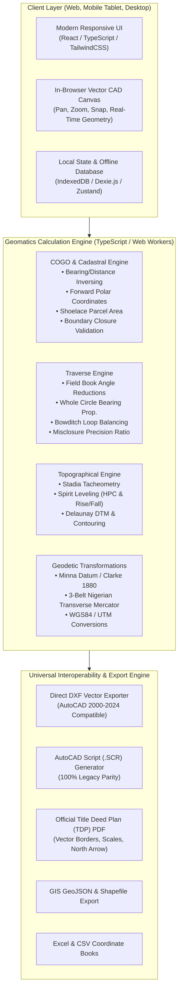
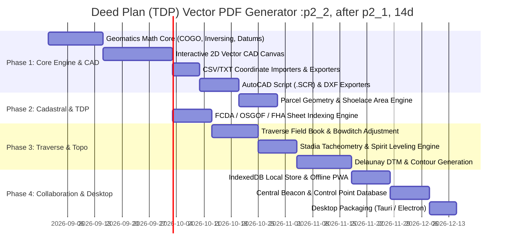

# SurvPack Modern Rebuild — Implementation Blueprint & Technical Architecture

> **Document Status**: Active Implementation Blueprint & Engineering Roadmap  
> **Target System**: SurvPack NextGen (Cloud-First, Offline-Ready Web & Desktop Geomatics Suite)  
> **Target Architecture**: React 18+ / Next.js / TypeScript + In-Browser Vector CAD Engine + High-Precision Geomatics Engine + Multi-Format Exporter  
> **Storage & Sync**: IndexedDB (Offline PWA) + Cloud Sync / Team Collaboration

---

## 1. Product Vision & Architectural Objectives

The modern rebuild transforms the legacy 32-bit Windows Visual Basic 6 desktop application into a **modern, cross-platform, collaborative Land Surveying, Cadastral, and Geomatics CAD suite**.



### Key Architectural Upgrades
1. **Live Interactive CAD Canvas**: Surveyors no longer work blind or have to switch between Notepad and AutoCAD. All coordinates, boundary polylines, bearings, distances, and areas render immediately with interactive pan, zoom, vertex snapping, and layer controls.
2. **Zero-Install, Cross-Platform & Offline-Ready**: Operates seamlessly in modern web browsers (Chrome, Edge, Safari, Firefox), field tablets (iPad/Android), and can be packaged as a native desktop executable via Tauri or Electron. Works completely offline in the field using IndexedDB local storage.
3. **Multi-User Collaboration**: Replaces loose text files (`.TXT`, `.DAT`) with a unified project database supporting multi-user role-based workflows (Field Surveyor $\to$ Senior QA Surveyor $\to$ Approving Director $\to$ Client).
4. **Direct Vector Output**: Generates production-ready **DXF drawings**, **AutoCAD Scripts (`.SCR`)**, **Vector PDF Title Deed Plans (TDP)**, **Excel sheets**, and **GIS GeoJSON** with a single click.

---

## 2. Technology Stack & Component Architecture

| Layer | Recommended Technology | Technical Rationale |
| :--- | :--- | :--- |
| **Frontend Framework** | **React 18+ with Next.js (or Vite) & TypeScript** | Strict type safety for mathematical and geometric coordinates; modular component architecture. |
| **Styling & Design System** | **TailwindCSS + Lucide Icons + Radix UI** | Modern, high-density CAD dark/light mode interface tailored for engineering tools. |
| **2D Vector CAD Engine** | **HTML5 Canvas 2D / WebGL (PixiJS or Paper.js)** | 60 FPS hardware-accelerated rendering capable of handling thousands of survey beacons, parcel polylines, annotations, and contour meshes smoothly. |
| **Geomatics Engine** | **Pure TypeScript (Modular Core Library)** | Isomorphic math library running both in the browser and in background Web Workers for heavy computations. |
| **Local Offline Storage** | **IndexedDB with Dexie.js** | Stores projects, coordinate databases, and field books locally on the device with zero internet connectivity. |
| **State Management** | **Zustand** | Lightweight, high-performance reactive state management for active CAD viewport, tool selections, and coordinate tables. |
| **DXF Generation** | **`dxf-writer` / Custom DXF Encoder** | Generates industry-standard DXF files with layers, text styles, colors, and line weights. |
| **PDF Title Deed Plans** | **jsPDF / PDFKit (Vector Engine)** | Generates official, high-resolution vector survey plans with crisp borders, seal blocks, north arrows, and dynamic bar scales. |
| **Spreadsheet I/O** | **SheetJS (`xlsx`)** | Seamless import and export of coordinate books and leveling sheets to/from Microsoft Excel and CSV. |
| **GIS Interoperability** | **Turf.js / GeoJSON / shp-write** | Standard spatial topology analysis, coordinate reprojection, and Shapefile packaging. |

---

## 3. Module-by-Module Technical Specification

### 3.1. Core Geomatics & COGO Engine (`packages/geomatics`)

#### A. Coordinate Inversing & Forward Geodesy
```typescript
export interface CoordinatePoint {
  id: string;
  easting: number;
  northing: number;
  elevation?: number;
  code?: string;
  description?: string;
  isControl?: boolean;
}

export interface BearingDistance {
  fromPoint: CoordinatePoint;
  toPoint: CoordinatePoint;
  deltaEasting: number;
  deltaNorthing: number;
  distance: number;
  bearingDegrees: number;
  bearingMinutes: number;
  bearingSeconds: number;
  bearingFormatted: string; // e.g. "142° 35' 20.4\""
}

export function inverseCoordinates(p1: CoordinatePoint, p2: CoordinatePoint): BearingDistance;
export function forwardCoordinates(origin: CoordinatePoint, bearingDecimalDeg: number, distance: number): CoordinatePoint;
```

#### B. Parcel Boundary Closure & Area (Shoelace Formula)
```typescript
export interface ParcelDefinition {
  plotNumber: string;
  ownerName?: string;
  blockNumber?: string;
  vertices: CoordinatePoint[];
}

export interface ParcelComputationResult {
  parcel: ParcelDefinition;
  areaSquareMeters: number;
  areaHectares: number;
  perimeter: number;
  isClosed: boolean;
  closureMisclose: number;
  legs: BearingDistance[];
}

export function computeParcelArea(vertices: CoordinatePoint[]): ParcelComputationResult;
```

#### C. Geodetic Datum Transformations (Minna Datum & Nigerian 3-Belt Grid)
```typescript
export enum NigerianGridBelt {
  WEST_BELT = 4.5, // Central Meridian 4° 30' E
  MID_BELT = 8.5,  // Central Meridian 8° 30' E (Abuja FCT)
  EAST_BELT = 12.5 // Central Meridian 12° 30' E
}

export interface DatumParameters {
  semiMajorAxis: number;     // a = 6378249.145 (Clarke 1880)
  inverseFlattening: number; // 1/f = 293.465
  falseEasting: number;      // 670553.984 m
  falseNorthing: number;     // 0.0 m
  centralScaleFactor: number;// 0.99975
}

export function geographicToNigerianTransverseMercator(lat: number, lon: number, belt: NigerianGridBelt): { easting: number; northing: number };
export function nigerianTransverseMercatorToGeographic(easting: number, northing: number, belt: NigerianGridBelt): { lat: number; lon: number };
```

---

### 3.2. Traverse Reduction & Bowditch Loop Balancing (`packages/traverse`)

```typescript
export interface TraverseLegObservation {
  fromStation: string;
  toStation: string;
  observedAngleDeg: number;
  observedAngleMin: number;
  observedAngleSec: number;
  slopeDistance: number;
  verticalAngleDeg?: number;
}

export interface TraverseAdjustmentResult {
  balancedCoordinates: CoordinatePoint[];
  totalPerimeter: number;
  linearMisclosureEasting: number;
  linearMisclosureNorthing: number;
  totalLinearMisclosure: number;
  relativePrecisionRatio: string; // e.g. "1:15,420"
  adjustmentMethod: 'BOWDITCH' | 'TRANSIT';
}

export function balanceTraverseLoop(
  startControl: CoordinatePoint,
  closeControl: CoordinatePoint,
  observations: TraverseLegObservation[],
  initialBacksightBearingDeg: number,
  method?: 'BOWDITCH' | 'TRANSIT'
): TraverseAdjustmentResult;
```

---

### 3.3. Topographical Reductions & Leveling Engine (`packages/topo`)

```typescript
export interface StadiaObservation {
  stationId: string;
  targetId: string;
  topHair: number;
  midHair: number;
  btmHair: number;
  verticalAngleDeg: number;
  instrumentHeight: number;
}

export interface LevelingRow {
  stationId: string;
  backsight?: number;
  intermediateSight?: number;
  foresight?: number;
  reducedLevel: number;
  remarks?: string;
}

export function reduceStadiaTacheometry(obs: StadiaObservation, stationElevation: number): { horizontalDistance: number; targetElevation: number };
export function reduceSpiritLeveling(rows: LevelingRow[], initialBenchmarkRL: number, method: 'HPC' | 'RISE_FALL'): { reducedRows: LevelingRow[]; arithmeticCheckPassed: boolean };
```

---

### 3.4. Interactive In-Browser 2D Vector CAD Canvas (`components/cad`)

The interactive canvas provides an engineering drafting workspace directly inside the browser:

```
+-----------------------------------------------------------------------------------------------+
| 🛰️ SurvPack NextGen  [Project: CKC_EXTENSION_LAYOUT]  [Scale: 1:1,000]   [Datum: Minna Mid-Belt]|
+-----------------------------------------------------------------------------------------------+
| 🛠️ TOOLS: [Select] [Add Beacon] [Draw Plot] [Measure] [Area] [Grid Ticks] [North Arrow] [Export]|
+-------------------+-------------------------------------------------------+-------------------+
| 📋 COORDINATES    | 🗺️ INTERACTIVE CAD VIEWPORT (WebGL / Canvas)          | 📑 PARCEL DETAILS |
| PointID  East   North |                                                   | Plot No: 204      |
| PB101 294312 992100 |          PB101 (294312, 992100)                     | Owner: Hadiza Isah|
| PB102 294366 992113 |            o-----------------------o PB102          | Area: 852.40 sq.m |
| PB103 294350 992080 |            |  72° 14' 35"  54.20m  | (294366, 992113| Perimeter: 118.4m |
| PB104 294295 992065 |            |                       |                | Status: Balanced  |
|                     |            |       PLOT 204        |                +-------------------+
| [+ Import CSV/TXT]  |            |   AREA: 852.40 SQ.M   |                | 🗂️ LAYERS         |
|                     |            |                       |                | [x] Boundary Lines|
| [🔍 Search Beacon]  |            o-----------------------o                | [x] Beacon Labels |
|                     |          PB104                   PB103              | [x] Bearings/Dist |
|                     |                                                     | [x] Grid Crosses  |
|                     |  [+] [ - ] [ ⛶ Zoom Extents ] [ 🧭 0.0° ]            | [ ] Contours (1m) |
+---------------------+-----------------------------------------------------+-------------------+
| 🚀 EXPORTS: [⬇️ AutoCAD Script (.SCR)]  [⬇️ DXF Drawing]  [⬇️ PDF Title Deed Plan]  [⬇️ Excel Table] |
+-----------------------------------------------------------------------------------------------+
```

---

### 3.5. Official Title Deed Plan (TDP) & Site Plan Generator (`packages/cartography`)

The vector PDF engine builds print-ready Title Deed Plans conforming to Nigerian national guidelines:
* **Outer & Inner Survey Margins** with official border styling.
* **Geodetic Grid Crosses** stamped with Easting/Northing coordinates along neatlines.
* **Vector North Arrow** ([N_ARROW](file:///d:/Store/Nacham%20Works/Surve/SurvPack30/SUPPORTS/Graphics/ARROWS/N_ARROW.dwg) equivalent).
* **Dynamic Metric Bar Scale** (1:125, 1:250, 1:500, 1:1,000, 1:2,000, 1:5,000) matching drawing scale.
* **Beacon Schedule Table** listing Beacon IDs, Eastings, Northings, and boundary line bearings/distances.
* **Surveyor's Seal & Signature Certificate Block** with Surveyor General registration placeholders.

---

## 4. Phased Implementation Roadmap



### Detailed Phase Breakdown

#### **Phase 1: Core Geomatics Computation & Interactive CAD Canvas**
* Build `@survpack/core`: TypeScript implementations of Coordinate Inversing, Polar Forward, Unit conversions (DMS $\leftrightarrow$ Decimal Degrees).
* Build the interactive CAD viewport: Hardware-accelerated canvas with smooth pan, zoom, grid ticks, snap-to-beacon, and dynamic bearing/distance labeling.
* Implement file parsers for legacy SurvPack `.TXT`, `.DAT`, `.XLS`, and modern CSV formats.
* Implement direct exporters for AutoCAD Script (`.SCR`) and industry-standard DXF.

#### **Phase 2: Cadastral Suite & Title Deed Plan (TDP) Generator**
* Implement parcel polygon definition, boundary topological checks, and Gauss's Shoelace area computation.
* Build the visual Title Deed Plan (TDP) layout designer with customizable borders, title blocks, and surveyor certification text.
* Integrate high-resolution vector PDF export with dynamic bar scales and north arrows.
* Build the FCDA, OSGOF, and FHA standard map sheet lookup and partitioning system.

#### **Phase 3: Traverse Reduction & Topographical/Leveling Modules**
* Build the interactive Traverse Field Book grid supporting Face Left / Face Right observations.
* Implement Bowditch (Compass Rule) and Transit Rule loop misclose adjustments.
* Implement Stadia Tacheometry reductions and Spirit Leveling computation tables (Rise & Fall / Collimation).
* Implement 3D terrain elevation interpolation (Delaunay Triangulation) and vector contour generation.

#### **Phase 4: Collaboration, Offline PWA & Desktop Packaging**
* Implement full offline operation using IndexedDB via Dexie.js for field surveying without internet.
* Build the Master Control Points & Beacon Registry with spatial duplicate detection.
* Package the application for native Windows, macOS, and Linux desktop distributions using Tauri.

---

## 5. Quality Assurance & Mathematical Parity Benchmark

To guarantee exact mathematical accuracy, the new engine will be verified against the included historic SurvPack benchmark datasets:

| Benchmark Dataset | Source Path | Validation Criteria | Target Accuracy |
| :--- | :--- | :--- | :--- |
| **CKC Extension Layout** | [PROJECTS/CADASTRAL/DATA/CKCEXTEN.TXT](file:///d:/Store/Nacham%20Works/Surve/SurvPack30/PROJECTS/CADASTRAL/DATA/CKCEXTEN.TXT) | Verify 100+ parcel boundary bearings, distances, and Shoelace polygon areas against original survey records. | **$100.000\%$ parity ($<0.001\text{ m}$, $<0.01\text{ sq.m}$)** |
| **VGIS Cadastral Job** | [PROJECTS/CADASTRAL/LAYOUTS/VGIS.SCR](file:///d:/Store/Nacham%20Works/Surve/SurvPack30/PROJECTS/CADASTRAL/LAYOUTS/VGIS.SCR) | Compare generated AutoCAD scripts line-by-line against legacy script output. | **Identical command sequences and precision** |
| **Abuja Topo Grid** | [PROJECTS/TOPO/WKSHTS_GRIDS/ABJ.DAT](file:///d:/Store/Nacham%20Works/Surve/SurvPack30/PROJECTS/TOPO/WKSHTS_GRIDS/ABJ.DAT) | Validate 3D spatial coordinate parsing and contour elevation interpolation. | **Exact elevation agreement** |
| **Traverse Loops** | [PROJECTS/TRAVERSE/LOOPS/](file:///d:/Store/Nacham%20Works/Surve/SurvPack30/PROJECTS/TRAVERSE/LOOPS/) | Verify Bowditch loop misclosure vector and adjusted coordinate tables. | **Sub-millimeter agreement ($< 0.0001\text{ m}$)** |

---

## 6. Summary of Deliverables

With this architecture and implementation plan:
1. **[LEGACY_ARCHITECTURE.md](file:///d:/Store/Nacham%20Works/Surve/LEGACY_ARCHITECTURE.md)** preserves the complete reverse-engineered knowledge base of the legacy system.
2. **[MODERN_REBUILD_IMPLEMENTATION_PLAN.md](file:///d:/Store/Nacham%20Works/Surve/MODERN_REBUILD_IMPLEMENTATION_PLAN.md)** provides a clear, production-ready roadmap for engineering the next-generation application.
