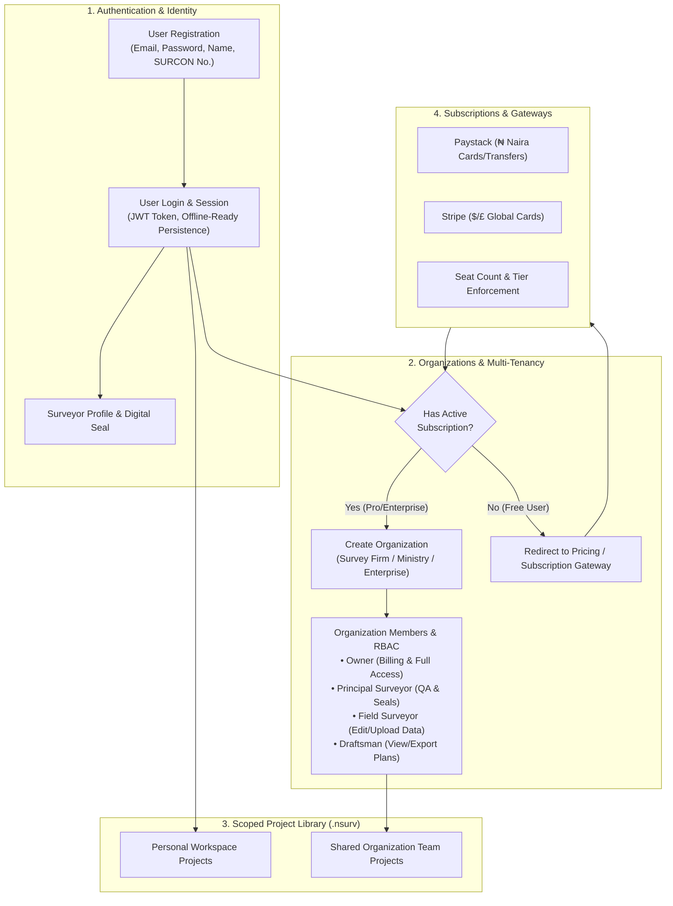

# NSurvey PRO — User Auth, Organizations, Project Library, Subscriptions & Desktop Packaging Plan

This implementation plan outlines the architectural blueprint and technical execution strategy for **NSurvey PRO**:
1. **User Authentication & Profile Engine**: Secure user registration, login, password recovery, session tokens, and SURCON credentials.
2. **Multi-Tenant Organizations & Multi-User RBAC**:
   - **Subscription-Gated Creation**: Only users with an active paid subscription can create and own an Organization.
   - **Organization Membership & Roles**: Owner, Principal Surveyor (Admin), Field Surveyor (Member), and Draftsman (Viewer).
   - **Team Collaboration**: Invite members by email, manage team seats, and share organization-wide project libraries.
3. **Project Library & File System**: Native `.nsurv` file bundles and offline-first IndexedDB Project Library Manager with organization-scoped projects.
4. **Subscription Models & Payment Gateway**: Paystack (₦ Naira) & Stripe ($ Global) billing with seat limits, tier management, and offline cryptographic licenses.
5. **SurvPack Legacy Full-Project Importer**: Universal migration engine parsing legacy SurvPack 3.0 directory trees in one click.
6. **Desktop Packaging**: Native desktop bundling using **Tauri 2.0 / Electron** with native file system access and offline persistence.

---

## 1. Multi-Tenant Auth & Organization Architecture



---

## 2. Data Models & Entity Schemas

### 2.1 User Entity (`src/engine/auth/authTypes.ts`)
```typescript
export type UserRole = 'OWNER' | 'ADMIN' | 'SURVEYOR' | 'VIEWER';

export interface User {
  id: string;
  email: string;
  fullName: string;
  surconNumber?: string;       // e.g. "SURCON Reg. No. 1845"
  nisChapter?: string;         // e.g. "Abuja / FCT Chapter"
  phone?: string;
  avatarUrl?: string;
  digitalSealUrl?: string;     // Base64 or URL of transparent stamp
  signatureUrl?: string;       // Base64 or URL of signature
  subscriptionTier: 'COMMUNITY' | 'PROFESSIONAL' | 'ENTERPRISE';
  subscriptionExpiresAt?: number; // Epoch timestamp
  activeOrganizationId?: string | null;
  createdAt: number;
}
```

### 2.2 Organization Entity
```typescript
export interface OrganizationMember {
  userId: string;
  email: string;
  fullName: string;
  role: UserRole;
  joinedAt: number;
}

export interface Organization {
  id: string;
  name: string;                // e.g. "Geotrek Survey & Engineering Services Ltd"
  slug: string;
  ownerUserId: string;
  subscriptionTier: 'PROFESSIONAL' | 'ENTERPRISE';
  maxSeats: number;            // e.g. Pro = 3 seats, Enterprise = 20+
  members: OrganizationMember[];
  firmLogoUrl?: string;
  officialSealUrl?: string;
  address?: string;
  defaultGridBelt?: 'WEST_BELT_4' | 'MID_BELT_6_30' | 'EAST_BELT_8_30';
  createdAt: number;
}
```

---

## 3. Core Component Breakdown

### 3.1 Authentication & Profile Studio (`src/components/auth/`)
- **`AuthModal.tsx`**:
  - Tabbed interface for **Sign In**, **Create Account**, and **Forgot Password**.
  - Collects name, email, password, and optional SURCON number / professional title.
  - Offline-first mock auth provider with seamless bridge to backend API (Supabase / custom REST backend).
  - Remembers login state across browser sessions and desktop restarts.
- **`UserProfileModal.tsx`**:
  - Surveyor profile details, NIS chapter, address, contact info.
  - Digital seal & signature upload with transparency check and live preview on sample Title Deed Plan.

### 3.2 Organization Management Studio (`src/components/organization/`)
- **`OrganizationStudioModal.tsx`**:
  - **Organization Dashboard**: Firm branding, official seal, default survey parameters.
  - **Team Member Directory**: List members, change roles (`Admin`, `Surveyor`, `Viewer`), remove members.
  - **Invite Team Member**: Send invite by email with assigned role; enforces subscription seat limit.
  - **Create Organization Wizard**:
    - **Subscription Verification Gate**: Checks if `currentUser.subscriptionTier !== 'COMMUNITY'`.
    - If un-subscribed: Prompts user to upgrade with instant Paystack/Stripe checkout.
    - If subscribed: Unlocks organization creation with custom slug, logo, and seat allocation.
- **TopBar Organization Switcher**:
  - Quick dropdown in the header allowing users to switch between **Personal Workspace** and their **Organizations**.

### 3.3 Project Library with Organization Scoping (`src/components/project/`)
- **`ProjectLibraryModal.tsx`**:
  - Filter projects by: **All Projects**, **Personal Projects**, or **Organization Team Projects**.
  - Shows author, last modified user, coordinate count, and parcel count.
  - One-click `.nsurv` bundle export/import, project duplication, and deletion.

### 3.4 Subscription & Payment Gateway Integration (`src/engine/licensing/`)
- **`SubscriptionModal.tsx`**:
  - Tier comparison cards:
    - **Community (Free)**: Personal projects, basic COGO & Area computations.
    - **Professional Surveyor (₦25,000 / $35 / mo)**: Unlimited points/parcels, all Geomatics calculation studios, Road Alignment & Earthworks, Subdivisions, Vector TDP with custom seal, DXF Studio, **Create 1 Organization (up to 3 team members)**.
    - **Enterprise Firm (₦80,000 / $110 / mo)**: Everything in Pro + **Multiple Organizations, up to 15 team members**, custom land registry GIS schemas, priority support.
  - **Gateway Integrations**:
    - **Paystack Checkout**: Nigerian Naira (₦) cards, bank transfers, USSD.
    - **Stripe Checkout**: International USD/GBP/EUR credit cards.
    - **Offline Cryptographic License**: 30-day offline grace key activation for field operations.

### 3.5 SurvPack 3.0 Full Project Importer (`src/components/importer/`)
- **`SurvPackMigrationModal.tsx`**:
  - Universal batch importer reading legacy SurvPack 3.0 directory trees (`REGISTER.TXT`, `COORDS/`, `PLOTS/`, `TRAV/`, `TOPO/`, `TDP/`).
  - Audits and migrates legacy jobs into modern `.nsurv` projects ready for team sharing.

### 3.6 Desktop Packaging (Tauri 2.0 / Electron)
- Native file system dialogs (`Open Project`, `Save As .nsurv`, `Export DXF`).
- Offline local SQLite database or filesystem storage in user's documents.
- Windows installer (`NSurvey_Setup_x64.exe` / `.msi`).

---

## 4. Implementation Phasing

```
Phase 1: User Authentication, Identity & Profiles
  ├── Step 1.1: Auth Types & Storage Engine (src/engine/auth/authEngine.ts)
  ├── Step 1.2: AuthModal.tsx (Sign In, Sign Up, Password Reset)
  └── Step 1.3: UserProfileModal.tsx (SURCON credentials & seal upload)

Phase 2: Multi-Tenant Organization & Subscription Gate
  ├── Step 2.1: Organization Engine & RBAC Rules (src/engine/organization/orgEngine.ts)
  ├── Step 2.2: OrganizationStudioModal.tsx (Firm profile, members, invites)
  ├── Step 2.3: Enforce Subscription-Gated Org Creation Logic
  └── Step 2.4: TopBar Organization Switcher & Header Profile Avatar

Phase 3: Scoped Project Library (.nsurv Bundle & IndexedDB)
  ├── Step 3.1: .nsurv Bundle Schema & Compressor (src/engine/project/projectBundle.ts)
  ├── Step 3.2: IndexedDB Multi-Project DB (src/engine/project/projectDb.ts)
  └── Step 3.3: ProjectLibraryModal.tsx with Personal/Org filtering

Phase 4: Subscription Models & Multi-Gateway Billing
  ├── Step 4.1: Paystack & Stripe Checkout Integration (src/engine/licensing/paymentEngine.ts)
  ├── Step 4.2: SubscriptionModal.tsx with live tier upgrades and seat calculators
  └── Step 4.3: Cryptographic Offline License Key Validator (src/engine/licensing/licenseEngine.ts)

Phase 5: SurvPack 3.0 Legacy Batch Project Importer
  ├── Step 5.1: Legacy Directory & Archive Parser (src/engine/importers/survpackProjectImporter.ts)
  └── Step 5.2: SurvPackMigrationModal.tsx with file/zip drag-and-drop

Phase 6: Desktop Packaging Configuration
  ├── Step 6.1: Scaffold desktop packaging wrapper (Tauri 2.0 / Electron)
  └── Step 6.2: Add desktop build scripts and native file dialog hooks
```

---

## 5. Verification Plan

### Automated & Logic Tests
- **Auth & RBAC Test**:
  - Test registration, login, token refresh, and session recovery.
  - Verify that a Free/Community user attempting to create an Organization is blocked and redirected to the Subscription modal.
  - Verify that a Professional/Enterprise user can successfully create an Organization and invite members.
  - Verify seat limit enforcement when inviting more members than allowed by the subscription tier.
- **Project Scoping Test**:
  - Verify that personal projects are only visible to the owner.
  - Verify that organization projects are visible to all members of that organization with appropriate read/write permissions based on their role.
- **SurvPack Importer Test**:
  - Run the parser on real files in `SurvPack30/PROJECTS/` and assert coordinate accuracy and parcel loop closures.
- **Billing & License Test**:
  - Test Paystack and Stripe checkout payloads and verify offline license token generation and hardware fingerprint hashing.

### User Flow Verification
- Register a new account $\to$ Verify profile reflects in TopBar avatar.
- Try creating an Organization as Free User $\to$ Verify subscription upgrade prompt appears.
- Simulate Pro subscription $\to$ Create organization "Geotrek Survey Ltd" $\to$ Upload firm seal $\to$ Invite team members.
- Create a project under the Organization $\to$ Switch to personal workspace $\to$ Verify separation of project libraries.
- Import a legacy SurvPack folder $\to$ Verify all coordinates and parcels load directly into the team project.
